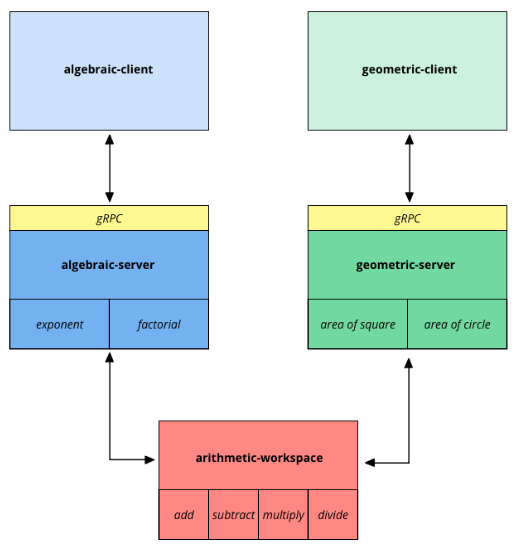
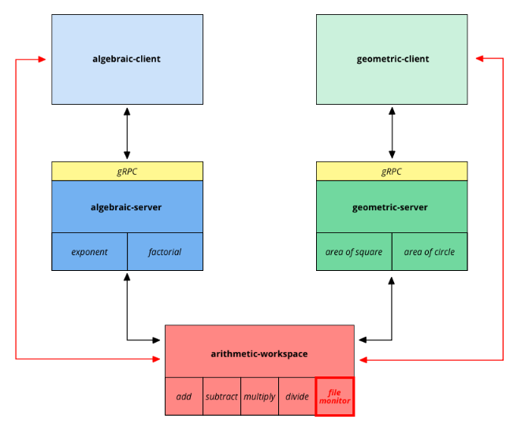

Welcome to the first issue of the **Nullnet Blog**!

In this post, we'll go through a **client-server architecture based on Rust's workspaces and gRPC**.<br/>
The architecture is designed to be **scalable**, **maintainable**, and **easy to extend**, making it a great starting point for your next project.

<!--truncate-->

:::info[About us]

We're a group of developers working daily with the Rust programming language and its ecosystem.

We're in the process of building an open-source, Rust-based **firewall management system** that operates at different layers of the network stack.<br/>
As we learn and experiment along the way, this blog aims to share our knowledge with the community — we hope you'll find the content useful and engaging.

We ourselves at Nullnet are setting up a codebase with a structure similar to the one we'll describe in this article.

:::

Too much introduction already, let's dive into the fun stuff!

## The problem

This blog post is inspired by a problem we faced while **designing the architecture** for the project we're working on.

We need to build a **distributed system** composed of multiple services that can communicate with clients over the network.<br/>
Clearly each service has to expose a set of functionalities to clients, but at the same time services need to share some **common functionalities** among them.<br/>
We want to avoid code duplication and ensure that the shared capabilities are maintained in a single place,
accommodating the need for new features — _and potentially new services using part of the existing functionalities_ — without requiring a complete overhaul of the existing codebase.

Moreover, we had in mind different requirements for the **client-server interactions**:
- **type safety**: clients must be able to interact with the services in a type-safe way, without having to handle manually the serialization and deserialization of messages
- **language independence**: clients and servers must be able to communicate regardless of the programming language they're implemented in; in fact, even if the core of our project is written in Rust, we still need to support clients that belong to different ecosystems
- **protocol transparency**: clients must not be aware of the underlying communication protocol — they should instead be able to call the services as if they were local functions
- **encryption**: the communication must be secured, ensuring that messages are properly encrypted during transmission

## Case study

To better illustrate the concepts we're going to discuss,
let's introduce a **toy project** that will serve as a case study.

For the sake of simplicity,
in this article we're going to implement **calculator services** that perform basic algebraic and geometric operations,
but the same concepts are applicable to arbitrarily complex systems.

Before starting with the actual code, let's define the **skeleton** for our calculator project.



As it's outlined in the diagram above, we want to create two different services:
- the `algebraic-server`, providing functionalities related to algebraic operations (e.g., factorials, powers)
- the `geometric-server`, exposing utilities related to geometric operations (e.g., computation of shape areas)

Both services will internally use a shared set of simple arithmetic operations
(addition, subtraction, multiplication, division) implemented in the `arithmetic-workspace` module.

Each of the two services will then be exposed to clients through a gRPC interface.

If you're not familiar with Rust's workspaces or gRPC, don't worry — we'll introduce them in the following.

In the next sections, we'll go through the high-level implementation of the `arithmetic-workspace`, the `algebraic-server`, the `geometric-server`, and the clients that will consume the services.

We don't want to overwhelm you with too much code, so we'll keep the snippets simple and focus on the core concepts of the architecture.

## Rust's workspaces

A [workspace](https://doc.rust-lang.org/book/ch14-03-cargo-workspaces.html) is a feature of Cargo — the Rust's package manager — that allows you to manage multiple packages that are part of the same project.<br/>
Each package in a workspace is called a _member_ of the workspace and is built as a separate crate, but all members share the same `Cargo.lock` file and `target`folder.

The `arithmetic-workspace` from our toy project is a perfect example of a module that can benefit from being structured as a workspace,
since it needs to provide multiple operations to be shared across different services.

In our case, the `arithmetic-workspace` will contain the following members:
- `add`: provides a method to add two floating point numbers
- `subtract`: provides a method to subtract two floating point numbers
- `multiply`: provides a method to multiply two floating point numbers
- `divide`: provides a method to divide two floating point numbers

To define a workspace,
we need to create a `Cargo.toml` file at the root of our project
and list its components under the `workspace.members` key:

```toml title="Cargo.toml"
[workspace]
members = [ "add", "subtract", "multiply", "divide" ]
```

After that,
creating the base structure for each member is as simple
as running `cargo new <member-name> --lib` in the root of the workspace.<br/>
This will create a new library crate with the given name inside the workspace.

In this case, the implementation of the libraries is trivial and will be omitted, as it only consists of a simple method to perform the corresponding operation.

Once the workspace is set up, we can move on to the implementation of the actual services.

## gRPC services

[gRPC](https://grpc.io) is a modern high-performance, open-source Remote Procedure Call framework that allows you to define **services** and **message types** using [Protocol Buffers](https://protobuf.dev),
a **language-agnostic** mechanism to serialize structured data.<br/>
It's a great choice for building robust distributed systems, as it provides a simple yet efficient and **type-safe** way to communicate between services.

Rust hasn't yet received official support for gRPC,
but the [`tonic`](https://github.com/hyperium/tonic) project provides a feature-rich,
production-ready implementation of gRPC for our beloved language.<br/>
Let's include the needed dependencies in the `Cargo.toml` file of the `algebraic-server` and `geometric-server`:

```toml title="Cargo.toml"
[dependencies]
tonic = { version = "0.12.3", features = ["tls", "tls-roots"] }
prost = "0.13.4"
tokio = { version = "1.42.0", features = ["rt-multi-thread"] }

[build-dependencies]
tonic-build = "0.12.3"
```

First of all, we need to define the **service interfaces** in a `.proto` file.<br/>
For our toy project, we'll create two separate files (`algebraic.proto` and `geometric.proto`), each containing the service definition for the corresponding server.

Here's what the `algebraic.proto` file looks like to define the endpoint for computing the exponent of a number:

```proto title="proto/algebraic.proto"
syntax = "proto3";

package algebraic;

service Algebraic {
  // Exponent
  rpc Exponent (ExponentMessage) returns (FloatResponse);
  // Other methods...
}

message ExponentMessage {
  float base = 1;
  uint32 exponent = 2;
}

message FloatResponse {
  float value = 1;
}
```

The `geometric.proto` file is similar, but it defines methods and message types to compute areas of squares and circles.

Once the `.proto` files are defined,
we can generate the Rust code for the services with the help of the `tonic-build` crate.<br/>
To do so, we need to add a `build.rs` file to our servers:

```rust title="build.rs"
const ALGEBRAIC_PROTOBUF_PATH: &str = "./proto/algebraic.proto";
const PROTOBUF_DIR_PATH: &str = "./proto";

fn main() {
    tonic_build::configure()
        .out_dir("./src/proto")
        .compile_protos(&[ALGEBRAIC_PROTOBUF_PATH], &[PROTOBUF_DIR_PATH])
        .expect("Protobuf files generation failed");
}
```

The `build.rs` file will generate the Rust code for the services in the `src/proto` directory.

:::warning[Protocol Buffer compiler installation]

To generate Rust code from `.proto` files,
you need to have the Protocol Buffer compiler (`protoc`) installed on your machine.<br/>
In the following it's reported how we're installing it for common operating systems in our GitHub workflow:

<details>

<summary>see details</summary>

```yaml
- name: Install macOS dependencies
  if: matrix.os == 'macos'
  run: |
    curl -OL https://github.com/google/protobuf/releases/download/v3.20.3/protoc-3.20.3-osx-x86_64.zip
    unzip protoc-3.20.3-osx-x86_64.zip -d protoc3
    sudo mv protoc3/bin/* /usr/local/bin/
    sudo mv protoc3/include/* /usr/local/include/

- name: Install Linux dependencies
  if: matrix.os == 'ubuntu'
  run: |
    curl -OL https://github.com/google/protobuf/releases/download/v3.20.3/protoc-3.20.3-linux-x86_64.zip
    unzip protoc-3.20.3-linux-x86_64.zip -d protoc3
    sudo mv protoc3/bin/* /usr/local/bin/
    sudo mv protoc3/include/* /usr/local/include/

- name: Install Windows dependencies
  if: matrix.os == 'windows'
  run: |
    Invoke-WebRequest -Uri "https://github.com/google/protobuf/releases/download/v3.20.3/protoc-3.20.3-win64.zip" -OutFile "C:\protoc.zip"
    Expand-Archive -LiteralPath "C:\protoc.zip" -DestinationPath C:\protoc
    echo "C:\protoc\bin" | Out-File -FilePath $env:GITHUB_PATH -Encoding utf8 -Append
```

</details>

:::

The next step is to implement the server logic for the services.<br/>
The code generated by `tonic-build` provides a trait that we need to implement for the related service:
its implementation will contain the actual logic for each of the service methods.

Here's a snippet of the implementation of the `exponent` method provided by the  `Algebraic` service:

```rust
pub struct AlgebraicImpl;

#[tonic::async_trait]
impl Algebraic for AlgebraicImpl {
    async fn exponent(
        &self,
        request: Request<ExponentMessage>,
    ) -> Result<Response<FloatResponse>, Status> {
        let ExponentMessage { base, exponent } = request.into_inner();

        let mut res = 1.0;
        for _ in 0..exponent {
            res = multiply::multiply(res, base);
        }

        let response = FloatResponse { value: res };
        Ok(Response::new(response))
    }
}
```

As you can see, we're using the `multiply` function from the `arithmetic-workspace` to compute the exponent, so we also need to add the `multiply` library as a dependency in the `Cargo.toml` file of the server.

We then need to create a `main.rs` file in each server crate to start the server and bind it to a specific address.

Here's the `main.rs` file for the `algebraic-server`:

```rust title="main.rs"
#[tokio::main]
async fn main() {
    let addr = SocketAddr::from_str("127.0.0.1:50051").unwrap();
    tonic::transport::Server::builder()
        .add_service(AlgebraicServer::new(AlgebraicImpl))
        .serve(addr)
        .await
        .unwrap();
}
```

This piece of code starts a gRPC server accepting plain unencrypted messages,
but `tonic` also supports encrypted connections using TLS —
you can find more information about it in the [official documentation](https://docs.rs/tonic/latest/tonic/transport/index.html).

But wait... we're still missing a crucial part: the **clients**!<br/> 
Even though the `algebraic-server` and `geometric-server` are intended to act as service implementors, we're going to use the same repositories to also expose **facades** for their clients.<br/>
This way, there is no need to include protobuf files in the clients' repositories, as they can use the same generated code from the servers.

What it means in practice is that our services will not only include a **binary target** to run the server, but also a **library** to be imported by clients to interact with the server itself.<br/>
More specifically, clients will use the library code exposed by the servers to create a gRPC channel and call the server methods.

In the following it's reported part of the `lib.rs` file for the `algebraic-server`, which defines a gRPC interface for its clients:

```rust title="lib.rs"
#[derive(Clone)]
pub struct AlgebraicGrpcInterface {
    client: AlgebraicClient<Channel>,
}

impl AlgebraicGrpcInterface {
    pub async fn new(addr: &'static str, port: u16) -> Self {
        let channel = Channel::from_shared(format!("http://{addr}:{port}"))
            .unwrap()
            .connect()
            .await
            .unwrap();
        Self {
            client: AlgebraicClient::new(channel),
        }
    }

    pub async fn exponent(&mut self, message: ExponentMessage) -> Option<FloatResponse> {
        self.client
            .exponent(Request::new(message))
            .await
            .map(tonic::Response::into_inner)
            .ok()
    }
}
```

Here we focused on part of the `algebraic-server` implementation, but the `geometric-server` follows the same overall structure and principles.

## Clients

The **clients** are the final piece of the puzzle.<br/>
They will use the gRPC interfaces exposed by the servers to perform remote procedure calls and consume the services.

For our toy project, we'll create two clients: one for the `algebraic-server` and one for the `geometric-server` —
we'll call them `algebraic-client` and `geometric-client`, respectively.

As previously mentioned, the clients will use the same generated gRPC code from the servers.<br/>
For this reason, clients don't need to directly include `tonic`-related dependencies in their `Cargo.toml` file,
but only the library target from the server they're going to consume.

To make things a little more interesting, each client won't just hardcode calls to the server endpoints, 
but will **receive inputs from a file that is continuously monitored for changes**.

The `algebraic-client` will read its inputs from a file
containing a list of power and factorial operations to perform
and will call the server for each of them.<br/>
Here is a sample input file to compute the mathematical operations `2^4` and `5!`:

```text
pow 2,4
factorial 5
```

In a similar fashion,
the `geometric-client` will read its inputs from a file
containing a list of area computation operations to perform and will invoke the server to compute them.<br/>
In the following, a sample input file to compute the areas of a square with side length `3` and a circle with radius `2`:

```text
square 3
circle 2
```

As you can see, files have a peculiar format that depends on the kind of supported operations.<br/>
Each client is in charge of **parsing** the input file and calling the appropriate server endpoint.<br/>
We won't go into the details of the parsing implementation here, as it's not relevant to the core concepts of the architecture.

What's more relevant is the way the **clients interact seamlessly with the servers**:
they're able to call the server endpoints without having to worry about the underlying gRPC communication details.<br/>
In fact, the clients will only interact indirectly with the gRPC layer through the facades exposed by the servers.

```rust title="Sample client-server interaction"
async fn call_server_sample() {
    let mut facade = AlgebraicGrpcInterface::new("localhost", 50051).await;
    let message = ExponentMessage { base: 2.0, exponent: 4 };
    let response = facade.exponent(message).await.unwrap();
}
```

Furthermore, what's interesting to note is that, despite each client needs to implement a specific parsing logic,
both clients need a **shared functionality** that is the ability to **monitor the input file for changes**:
this is another sample use case for a shared library.

Following the same pattern we used for the servers,
we can add a new member to our `arithmetic-workspace` to contain the shared functionality for the clients.<br/>
Let's call this library `file_monitor` and refactor our workspace to include two different subfolders: one for the server-related libraries and one for the client-related ones.

It's worth mentioning that while the `file_monitor` library will be imported by both clients, 
it's not a dependency of the servers, so it won't be included in the server's manifest file.

The final structure of the workspace will look like this:

```text
├── Cargo.lock
├── Cargo.toml
├── client_libraries
│   └── file_monitor
├── server_libraries
│   ├── add
│   ├── subtract
│   ├── multiply
│   └── divide
└── target
```

Last but not least,
here is the updated architecture diagram highlighting that also the clients are now using a shared library from the workspace:



## Wrapping up

In this article, we've gone through the implementation of an architecture based on Rust's workspaces and gRPC.<br/>
We've seen how to structure a project with multiple services using shared libraries from a workspace,
how to define gRPC servers that include facades for their own clients, and how to use Protocol Buffers to define service interfaces.

:::tip[Source code]

In case you're interested in taking a closer look at the source code,
you can find the full implementation of the discussed modules on our GitHub:
- [`arithmetic-workspace`](https://github.com/NullNet-ai/arithmetic-workspace)
- [`algebraic-server`](https://github.com/NullNet-ai/algebraic-server)
- [`geometric-server`](https://github.com/NullNet-ai/geometric-server)
- [`algebraic-client`](https://github.com/NullNet-ai/algebraic-client)
- [`geometric-client`](https://github.com/NullNet-ai/geometric-client)

:::

Stay tuned for the next blog post, with more insights about Rust, networking, security, and distributed systems!
